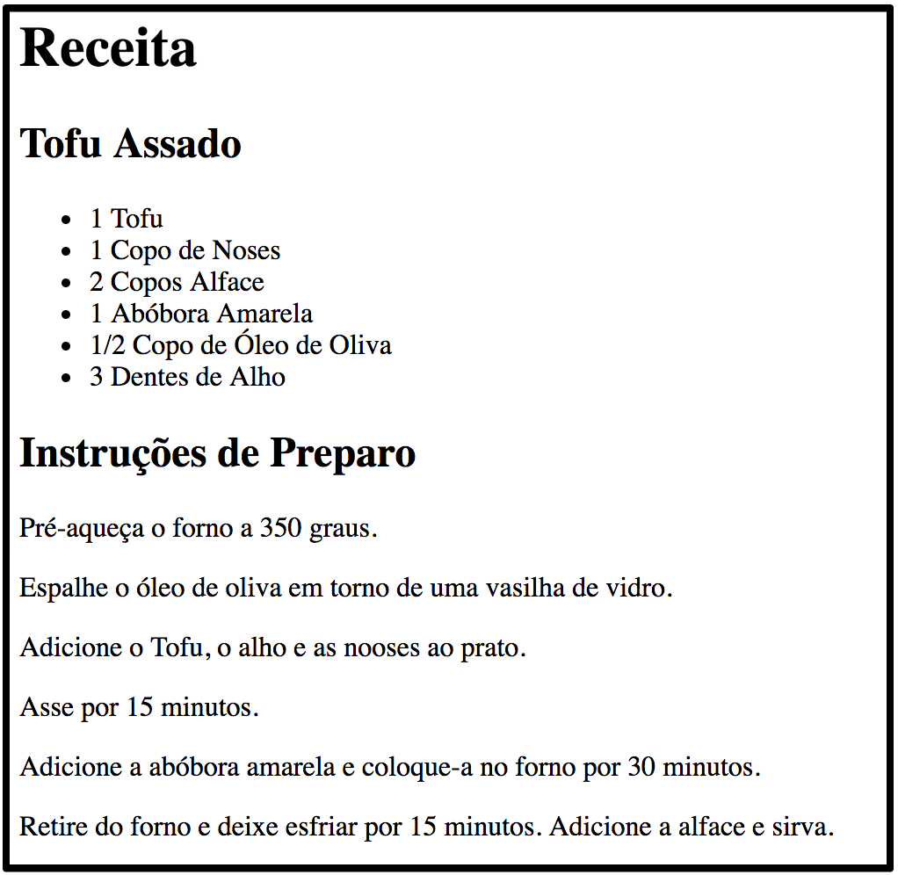

# React Puro

Esta parte é baseada no Capítulo 4 do livro *Learning React*. O objetivo é entender o que está acontecendo nos bastidores de um programa escrito em React.

## Atividade

Nesta atividade vamos implementar uma página que mostra uma receita de Tofu.

Vamos seguir os seguintes passos:

1. Implementar os elementos usando as funções do React
2. Extrair componentes React em classes
3. Extrair componentes React em funções

### :framed_picture: Objetivo

A imagem abaixo mostra o resultado final esperado:

